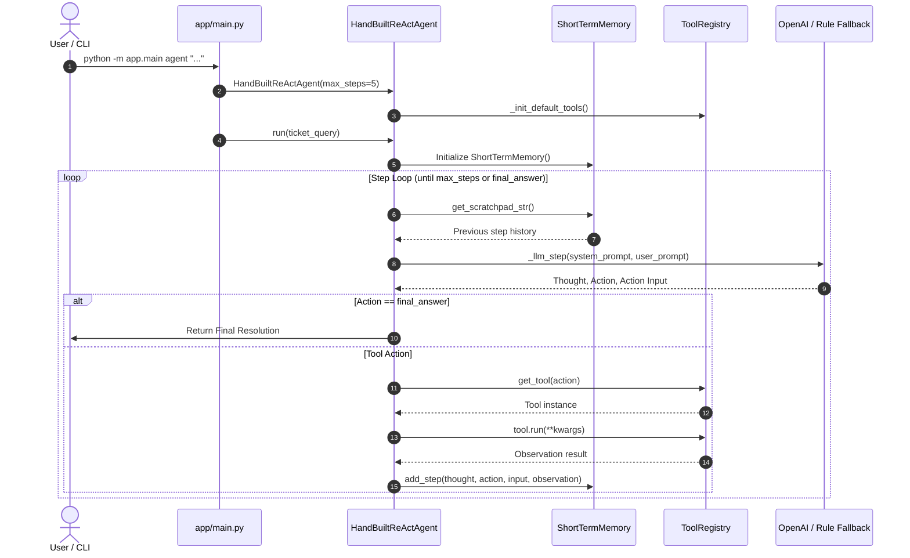

# Week 7 Implementation: Agentic RAG & Hand-Built ReAct Agent Engine

## Overview

In **Week 7**, the project transitions from standard passive Retrieval-Augmented Generation (RAG) to an **Agentic RAG Engine**. Instead of relying on a single fixed search-and-generate pipeline, Week 7 introduces an autonomous **ReAct (Reasoning + Acting)** Agent that dynamically selects tools, queries vector databases, evaluates mathematical formulas, checks metadata databases, escalates policy exceptions, and self-corrects on errors.

---

## System Architecture

```mermaid
flowchart TD
    User Ticket / Query --> ReActAgent[Hand-Built ReAct Agent]
    
    subgraph Memory System
        ShortTermMemory[Short-Term Scratchpad Memory]
        LongTermMemory[Long-Term JSON Resolution Storage]
    end
    
    subgraph Tool Registry
        T1[lookup_policy: Hybrid Vector + BM25 Search]
        T2[check_ticket_db: Mock SQL Ticket DB Query]
        T3[calculate_amount: Safe AST Math Evaluator]
        T4[escalate_ticket: Exception Handling]
        T5[final_answer: Resolution Synthesis]
    end

    subgraph Safety Guardrails
        G1[Max Steps Limit: 5]
        G2[Token Budget Limit: 4000 Tokens]
        G3[Timeout Limit: 30 Seconds]
        G4[Duplicate Tool Loop Detection]
    end

    ReActAgent <--> Memory System
    ReActAgent --> Safety Guardrails
    ReActAgent --> Tool Registry
    Tool Registry --> Final Output[Ticket Resolution & Performance Metrics]
```

---

## How the ReAct Agent is Created (Step-by-Step Build Process)

Creating the ReAct Agent in this codebase involves 5 core steps across [`app/agent.py`](file:///d:/chat%20bot/app/agent.py), [`app/tools.py`](file:///d:/chat%20bot/app/tools.py), [`app/memory.py`](file:///d:/chat%20bot/app/memory.py), and [`app/main.py`](file:///d:/chat%20bot/app/main.py):



### Step 1: Building the Tool Registry (`app/tools.py`)
1. **Tool Class Container**: Wraps a python function with a human-readable `name` and detailed `description`.
2. **Default Tool Registration**:
   - `lookup_policy`: Connects to `HybridSearchEngine` (Qdrant + BM25).
   - `check_ticket_db`: Reads dictionary record from `MOCK_TICKET_DB`.
   - `calculate_amount`: Uses Python's `ast.parse` for safe evaluation.
   - `escalate_ticket`: Flags exceptions for manual managerial review.
   - `final_answer`: Signals agent completion.
3. **Prompt Formatting**: `format_tools_for_prompt()` formats tool signatures into text instructions for the LLM system prompt.

### Step 2: Constructing Short-Term & Long-Term Memory (`app/memory.py`)
1. **`ShortTermMemory`**:
   - Stores chronological tuples of `(step, thought, action, input, observation)`.
   - Formats history into a string block (`scratchpad`) sent with every prompt cycle.
   - Accumulates `prompt_tokens` and `completion_tokens`.
   - Detects state loops using MD5 hashes (`md5(action + action_input)`).
2. **`LongTermMemory`**:
   - Persists ticket decisions to `./data/long_term_memory.json`.

### Step 3: Agent Class Initialization (`app/agent.py`)
1. Accepts configuration: `max_steps=5`, `max_tokens=4000`, `timeout_sec=30.0`.
2. Reads API credentials (`OPENROUTER_API_KEY`, `OPENAI_API_KEY`).
3. Instantiates `OpenAI` client configured with base URL (e.g. OpenRouter or OpenAI).

### Step 4: The ReAct Execution Loop (`HandBuiltReActAgent.run()`)
1. **System Prompt Synthesis**: Formats `REACT_SYSTEM_PROMPT` with registered tool descriptions.
2. **Safety Budget Checks**: Verifies elapsed wall-clock time (`< timeout_sec`) and token counters (`< max_tokens`).
3. **LLM Step Generation (`_llm_step`)**:
   - Sends System Prompt + User Prompt (Ticket + Scratchpad).
   - Instructs LLM to output structured text:
     ```text
     Thought: <reasoning>
     Action: <tool_name>
     Action Input: <input_parameters>
     ```
   - Uses regex (`_parse_react_response`) to extract `thought`, `action`, and `action_input`.
   - **Offline Rule Fallback**: If LLM API fails or is offline, `_offline_step_fallback()` supplies deterministic step rules.
4. **Action Execution & Self-Correction**:
   - If `action == "final_answer"`, loop terminates and returns the resolution.
   - Checks `memory.is_looping()` to catch duplicate tool calls.
   - Fetches tool from registry and runs `tool.run(**kwargs)`.
   - Adds observation to `ShortTermMemory`.

### Step 5: Invocation from CLI Controller (`app/main.py`)
The CLI parser instantiates and runs the agent:
```python
agent = HandBuiltReActAgent(max_steps=args.max_steps)
res = agent.run(args.question, verbose=True)
```

---

## Summary of New Files Implemented in Week 7

| File Path | Component Name | Core Purpose |
| :--- | :--- | :--- |
| [`app/agent.py`](file:///d:/chat%20bot/app/agent.py) | **ReAct Agent Core Engine** | Implements the hand-built ReAct reasoning loop (`Thought` $\rightarrow$ `Action` $\rightarrow$ `Observation`), safety guardrails, and LLM/offline execution logic. |
| [`app/tools.py`](file:///d:/chat%20bot/app/tools.py) | **Tool Registry & Toolset** | Defines tools (`lookup_policy`, `check_ticket_db`, `calculate_amount`, `escalate_ticket`, `final_answer`) and mock SQL database. |
| [`app/memory.py`](file:///d:/chat%20bot/app/memory.py) | **Dual-Tier Memory System** | Manages `ShortTermMemory` (step history scratchpad, token tracking, loop detection) and `LongTermMemory` (ticket resolution persistence). |
| [`app/workflow.py`](file:///d:/chat%20bot/app/workflow.py) | **Plain Fixed Workflow** | Implements a deterministic, non-agent 3-step pipeline used as a control benchmark against the ReAct agent. |
| [`app/race.py`](file:///d:/chat%20bot/app/race.py) | **Agent vs. Workflow Race Engine** | Benchmarks the ReAct Agent against the Fixed Workflow across 10 evaluation tickets on Latency, Cost, and Accuracy. |
| [`tests/ticket_eval_set.json`](file:///d:/chat%20bot/tests/ticket_eval_set.json) | **Benchmark Dataset** | Contains 10 real-world customer and employee support tickets covering refunds, meal caps, sick leaves, and escalations. |

---

## Detailed File Implementations & Purpose

### 1. `app/agent.py` — Hand-Built ReAct Agent Loop
* **File Location**: [`app/agent.py`](file:///d:/chat%20bot/app/agent.py)
* **Purpose**: Serves as the central autonomous engine that orchestrates reasoning steps, tool selection, observation processing, and response generation.
* **Key Components**:
  - `REACT_SYSTEM_PROMPT`: Directs the LLM to output structured steps using `Thought:`, `Action:`, and `Action Input:`.
  - `HandBuiltReActAgent.run()`: Main execution loop driving the step cycle.
  - **Safety Guardrails**:
    1. *Max Steps Limit* (`max_steps=5`): Halts after 5 steps.
    2. *Token Budget Limit* (`max_tokens=4000`): Prevents token overspending.
    3. *Timeout Budget* (`timeout_sec=30.0`): Prevents hanging requests.
    4. *Loop Detection* (`is_looping()`): Identifies and breaks duplicate tool call loops.
  - `_offline_step_fallback()`: Rule-based fallback parser guaranteeing seamless demo execution even without live API keys.

---

### 2. `app/tools.py` — Tool Registry & Definition Infrastructure
* **File Location**: [`app/tools.py`](file:///d:/chat%20bot/app/tools.py)
* **Purpose**: Registers, formats, and executes all functions that the ReAct Agent can call.
* **Tools Defined**:
  1. `lookup_policy(query)`: Performs Hybrid BM25 + Qdrant Dense Vector Search over ingested policy documents.
  2. `check_ticket_db(ticket_id)`: Queries order metadata, purchase dates, amount, and item conditions from `MOCK_TICKET_DB`.
  3. `calculate_amount(expression)`: Uses Python's `ast` module to safely compute mathematical formulas (e.g. `min(85, 75) + min(60, 75)`).
  4. `escalate_ticket(ticket_id, reason)`: Flag tickets requiring manual VP or managerial review (e.g. late submissions > 30 days).
  5. `final_answer(resolution)`: Concludes agent execution with the finalized response.

---

### 3. `app/memory.py` — Short-Term Working Memory & Long-Term Memory
* **File Location**: [`app/memory.py`](file:///d:/chat%20bot/app/memory.py)
* **Purpose**: Provides context tracking during agent execution and persistent storage across sessions.
* **Classes**:
  - `ShortTermMemory`:
    - Maintains chronological `(step, thought, action, input, observation)` entries.
    - Formats step history into a `scratchpad` string for prompt context.
    - Counts cumulative prompt and completion tokens.
    - Identifies duplicate actions using state hash matching.
  - `LongTermMemory`:
    - Saves ticket resolutions to `./data/long_term_memory.json`.
    - Enables historical query lookups for past resolved tickets.

---

### 4. `app/workflow.py` — Deterministic Plain Fixed Workflow
* **File Location**: [`app/workflow.py`](file:///d:/chat%20bot/app/workflow.py)
* **Purpose**: Provides a baseline non-agent pipeline to evaluate whether an autonomous agent is truly necessary.
* **Pipeline Sequence**:
  - **Step 1**: Search policy documents via Hybrid Search.
  - **Step 2**: Fetch ticket details from the database.
  - **Step 3**: Single LLM prompt call to generate the final decision.

---

### 5. `app/race.py` — Benchmark & Race Engine
* **File Location**: [`app/race.py`](file:///d:/chat%20bot/app/race.py)
* **Purpose**: Compares the ReAct Agent against the Plain Fixed Workflow on 10 evaluation tickets.
* **Evaluated Metrics**:
  1. **Latency**: Execution wall-clock time in seconds.
  2. **Cost**: Total tokens used and estimated USD cost based on standard model pricing.
  3. **Reliability**: Resolution accuracy and proper policy exception handling (e.g., escalating late expense reports).

---

### 6. `tests/ticket_eval_set.json` — Evaluation Dataset
* **File Location**: [`tests/ticket_eval_set.json`](file:///d:/chat%20bot/tests/ticket_eval_set.json)
* **Purpose**: Serves as the ground-truth benchmark suite for performance comparison.
* **Sample Ticket Types**:
  - Standard physical product refund within 30 days (`TICK-101`).
  - Non-refundable software license request (`TICK-102`).
  - Business travel meal allowance capping at $75/day (`TICK-103`).
  - Late expense report submitted 45 days late requiring escalation (`TICK-104`).
  - Annual leave carry-forward caps (`TICK-105`).
  - Mileage reimbursement calculations at $0.65/mile (`TICK-109`).

---

## How to Run the Week 7 CLI Commands

Execute the following commands from the root directory:

```bash
# 1. Run the Hand-Built ReAct Agent on a single support ticket
python -m app.main agent "Customer Alice requested a refund for order TICK-101 purchased 12 days ago ($120). Check policy and process."

# 2. Run the Agent vs. Plain Fixed Workflow Race Benchmark
python -m app.main race

# 3. Start an Interactive Chat with the ReAct Agent
python -m app.main chat
```
